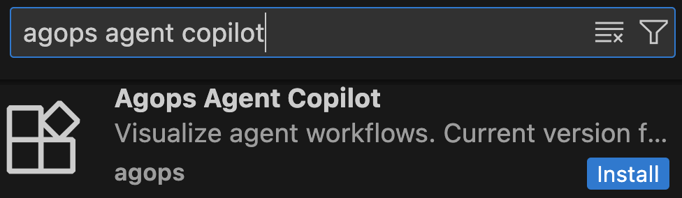

# BIRD Text2SQL Benchmark

## Installation

We recommend Python 3.13 but any version >=3.10 should work.

**Installing our tool:** Open VS Code (or a VS Code-based editor like Cursor). In the VS Code marketplace, search for "agops agent copilot" and install the first extension: 



Then run `pip install agops-bird`. Also run `pip install openai`.

Run `aco-config` and configure as follows:

1. Check that the default path displayed is the `bird-bench` directory.
2. Enable telemetry: yes. If you don't have the URL and key below, set telemetry to no.
3. Telemetry URL: XXX
4. Telemetry key: XXX
5. Telemetry username: Enter a name or take default

**Setting up API keys:** Run `export OPENAI_API_KEY=XXX`. If you need a key, text ferdi.kossmann@gmail.com.

## Using our tool

Our tool will show you runs of the evaluation set (Sample 0, Sample 1, ...). Correct samples will be shown with a green bar, incorrect ones with a red bar. You can click on samples and inspect the inputs and outputs of LLM calls and calls to the database and even modify them to see what would have happened if the input or output to/from an LLM were different.

If you have any questions, please reach out to me at `ferdi [dot] kossmann [at] gmail [dot] com`.

## Developing a workflow

> [!CAUTION]
> In the light of this user study, you may only invoke LLMs using the OpenAI `chat.completions.create` API call (also see `workflow/example.py`):
>
> ```
> from openai import OpenAI
> client = OpenAI()
> response = client.chat.completions.create(...)
> ```
> If you want to make a call to the database, you have to use the `utils.call_db(sql_str)` function (no need to create a connections or cursor). The function will return the same object as an actual call to the SQL DB would. 


### Run workflow and evaluation

When running our tool, the only difference is that you type `develop script.py` instead of `python script.py`. Practically, this means the following:

If you want to evaluate and run an individual sample `X`, do `develop workflow/main.py --sample_id X`.

When you want to evaluate several samples, run `python run_and_evaluate.py --num_samples X`, which will run the first `X` samples of the benchmark. `run_and_evaluate.py` spawns the workflow runs using the `develop` command, so the workflows are run with our tool.

**Getting started:** 
1. Run `python run_and_evaluate.py` to process all 40 samples in the benchmark. You should see the following output:
   


2. You should be able to hover over nodes in the graph (which consists of a single node), and edit the input or output. If you click on the green rerun button, the workflow will rerun with the changes you made. This allows you to ask "what-if questions" (what if the input/output would have been different?).


3. If you click on the eraser symbol, all your input/output edits will be removed and the workflow is run as defined in the code. 

4. The code of the workflow is in `workflow/example.py`. It simply calls gpt-3.5 with the input.
   
5. The workflow is called from `workflow/main.py`. We recommend to leave much of the logic in `workflow/main.py` the same and use it to call your workflow.

**Understanding correctness**: In the list view at the left in the UI, samples that failed the benchmark test are shown through a red bar. The ones that passed through a green bar.